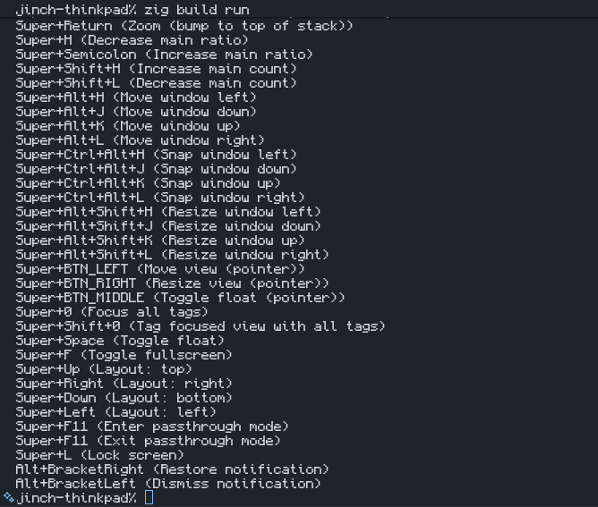

# keybind-preview

A tool to scrape river (Wayland compositor) keybindings from ~/.config/river/init
or a file of your choosing.

Eventually I would like to have a GUI helper where you can search a list of bindings, among other features, see the [TODOs](#todos).

# TODOs

- GUI helper with cool SVGs for keys? Using `fzf`/similar for text search?
- See if I can use a Wayland protocol to support other use cases (currently only supports scripts using `riverctl map(-pointer)`).
- No description should fallback to storing the command to be executed.
- Make this extendable to other configuration formats/WMs/compositors/software?
- A DSL w/ library interface. Would be nice to use for software like Blender. You could feed an LLM the DSL spec and docs for your favourite software.
- Generation of nice looking cheat sheets (SVGs, PNGs etc).

Also, I have just realised that using some wayland protocol will preclude you from using descriptions. However the DSL could also solve this issue so long as we can have the software setup keybinds for your compositor.

# Expected input

Currently this tool will only work on shell scripts making calls to `riverctl` like so:

```sh
riverctl map LAYER MODIFIERS ACTION ## Description goes here.
```

Note that the double comment has to be on the same line as the binding for this tool to see it (at present).

If you have a binary in this location, this is not yet supported, but stay tuned (see TODOs).

# Current output


